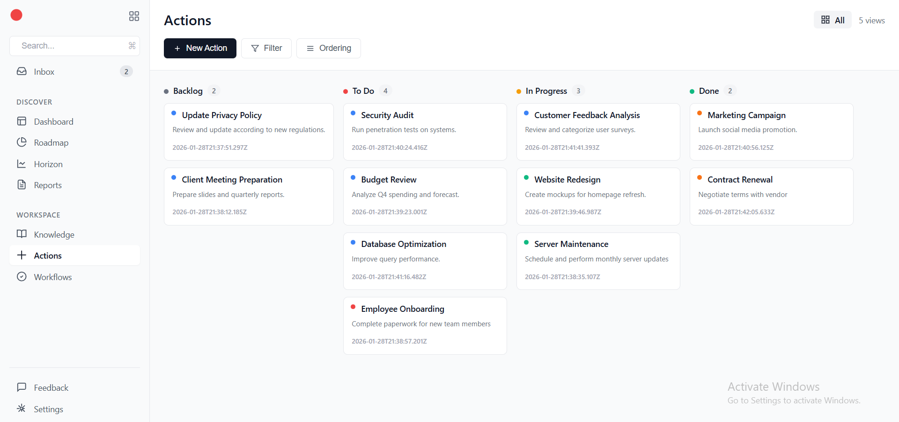

# Kanban-board

A Kanban board application that allows users to organize and manage their tasks across different workflow stages using drag-and-drop functionality.



## Features

- Create new tasks with title and description
- Delete tasks
- Drag and drop tasks between columns (Backlog, To Do, In Progress, Done).
- Data persists after page refresh using localStorage.
- Visual color indicators for each column.
- Colored avatar circles for task cards.

## Tech Stack

- HTML5
- CSS3
- Vanilla JavaScript
- localStorage API

## Development Process

I started by designing the data structure, using a normalized approach with tasks stored separately from columns for better performance. Then I built the HTML and CSS to visualize how cards and columns would look. I began with hardcoded data, then implemented the render functions to generate the DOM dynamically. After that, I added create and delete functionality, followed by localStorage persistence. Finally, I implemented the drag-and-drop feature using the HTML5 Drag and Drop API.

## Future Improvements

- Optimize rendering by updating only changed elements instead of re-rendering the entire board.
- Fix task reordering within the same column.
- Add edit task functionality.
- Implement project sections where each project has its own set of tasks (requires backend integration).

## How to Run

1. Clone the repository
```bash
   git clone https://github.com/MahmoudAlHaj4/kanban-board.git
```
2. Open `index.html` in your browser
